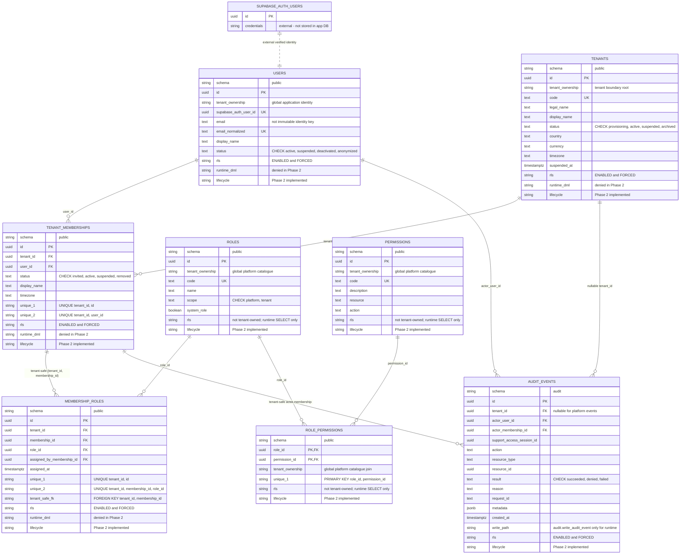

# Database Foundation ERD

Status: Phase 2 database foundation implemented
Date: 2026-07-28

This is the editable source for the Phase 2 database relationship diagram. It
matches the implemented migration objects only.

Supabase Auth is external to the application database. It owns credentials,
password handling, provider identities, refresh tokens, MFA, password recovery,
and session mechanics. The application database stores only the verified
Supabase Auth user ID mapping on `public.users`.

Trusted helper functions live under `private` and are not normal tables:

- `private.current_tenant_id()`
- `private.current_user_id()`
- `private.current_membership_id()`
- `private.current_support_access_session_id()`
- `private.current_request_id()`
- `private.is_platform_admin()`
- `private.has_tenant_context(uuid)`
- `private.has_support_tenant_context(uuid)`
- `audit.write_audit_event(...)`

Implemented relationship rules:

- `tenant_memberships` uses `UNIQUE (tenant_id, id)` and `UNIQUE (tenant_id, user_id)`.
- `membership_roles` uses composite tenant-safe foreign keys to memberships.
- Runtime DML on tenants, users, tenant memberships, and membership-role
  assignments is denied in Phase 2. Future write paths need explicit service
  authorization and/or reviewed security-definer functions.
- `audit.audit_events` stores nullable tenant scope only for platform-valid events.
- No password, password hash, password salt, refresh token, or duplicate session
  column exists in the application data model.
- Future tenant-owned tables must include `tenant_id` and composite foreign keys
  to tenant-owned parents; they are not created in Phase 2.
