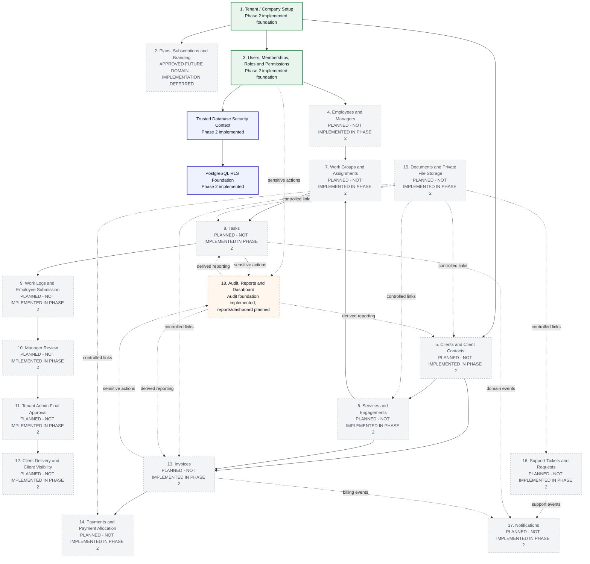

# System Module Flow

Status: Phase 2 database foundation implemented
Date: 2026-07-28

This is the source-controlled business process and module-flow diagram for the
approved multi-tenant SaaS architecture. It follows the supplied two-level
architecture pattern, while the accepted ADRs and implemented migrations remain
the technical source of truth.

Legend:

- Solid arrow: required business or data dependency.
- Dashed arrow: optional, asynchronous, conditional, or future dependency.
- Phase 2 implemented: foundational database boundary exists in migrations.
- Planned: approved future scope, not implemented in Phase 2.

Phase 2 scope guard: this diagram names the complete approved business flow,
but only the highlighted foundation exists in Phase 2 migrations. Business
tables for subscriptions, workforce, clients, engagements, work groups, tasks,
work logs, billing, documents, support, notifications, reports, and dashboards
must wait for their own approved implementation phases.
